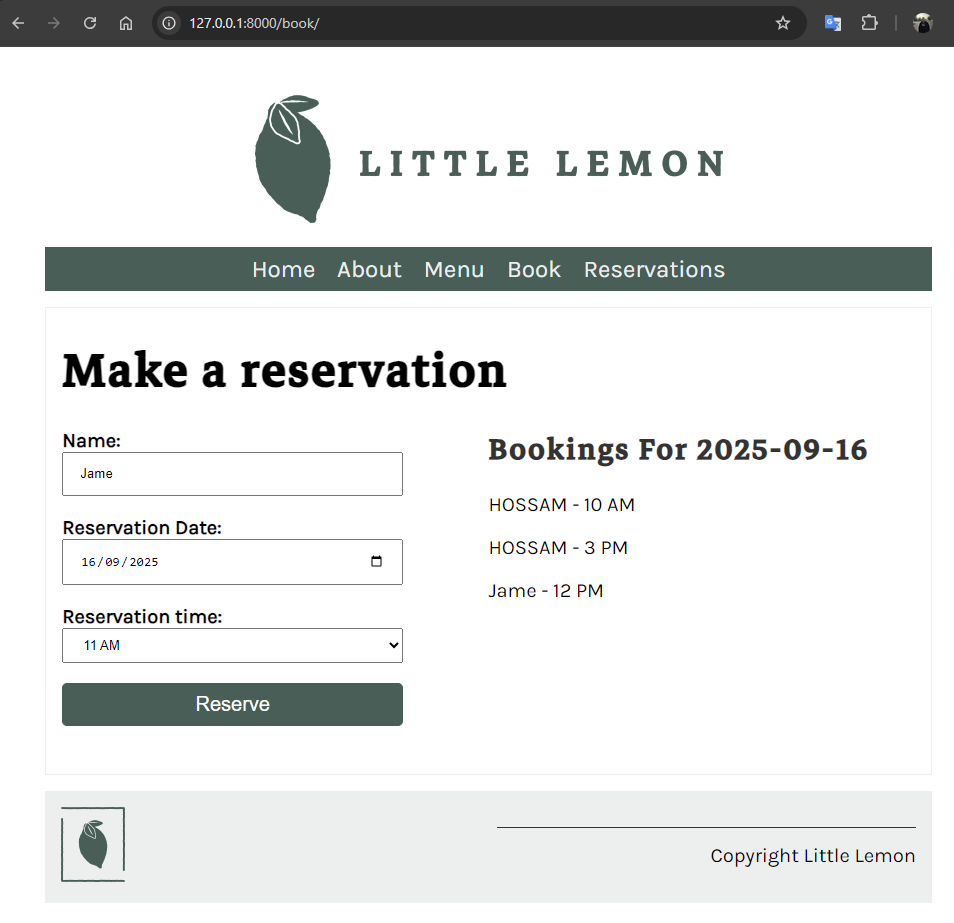
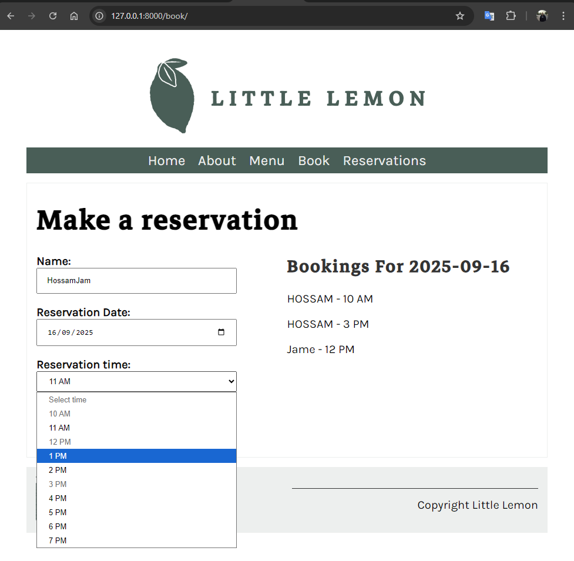
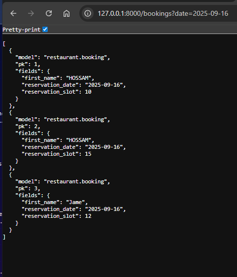

# Meta The Full Stack Course - Final Project: Little Lemon Restaurant Booking System

## Overview

This repository contains the final peer-graded project for the Meta The Full Stack course on Coursera, combining skills in Django, MySQL, and JavaScript to create a fully functional booking system for Little Lemon, a fictional restaurant. The project consists of three exercises: connecting the back-end to MySQL, setting up a booking API, and implementing dynamic reservation management with JavaScript. The application features a booking form, a reservations page, and API endpoints to display reservation data, ensuring duplicate bookings are prevented and timeslots are dynamically updated.

## Technologies Used

- **Framework**: Django
- **Database**: MySQL
- **API**: Django REST Framework
- **Frontend**: HTML, CSS, JavaScript
- **Dependencies**: Managed via `Pipfile`
- **Tools**: VS Code, pipenv

## Project Structure

```
.
├── littlelemon/             # Project directory
│   ├── __init__.py
│   ├── asgi.py
│   ├── settings.py          # MySQL database configuration
│   ├── urls.py              # Project-level URL configurations
│   └── wsgi.py
├── restaurant/              # App directory
│   ├── __init__.py
│   ├── admin.py
│   ├── apps.py
│   ├── migrations/          # Migration files
│   ├── models.py            # Booking model
│   ├── forms.py             # Booking form
│   ├── templates/           # HTML templates
│   │   ├── restaurant/
│   │   │   ├── book.html      # Booking form template
│   │   │   ├── bookings.html  # Reservations page template
│   │   │   ├── index.html
│   │   │   └── partials/
│   │   │       └── _header.html
│   ├── tests.py
│   ├── urls.py              # App-level URL configurations
│   └── views.py             # View functions
├── manage.py                # Django management script
├── Pipfile                  # Pipenv dependency file
├── Pipfile.lock
├── static/                  # Static files (CSS, images)
└── screenshots/             # Demo screenshots
    ├── 1-Booking-form-with-a-list-of-current-reservations.PNG
    ├── 2-Duplicate-booking-is-not-possible-on-the-booking-form.-Note-how-the-booked-time-slots-are-grey.png
    ├── 3-All-reservations-are-available-as-JSON-data-on-the-reservations-page.PNG
    ├── 4-All-reservations-for-a-specific-date-returned-from-the-bookings-API-endpoint.PNG
```

## Setup and Usage Guide

Follow these steps to download, set up, and use the Little Lemon booking system on your local machine.

### 1. Prerequisites
- Install Python 3.8+ and pip.
- Install MySQL on your local machine with the `root` user (default password: `password` or blank).
- Install VS Code.

### 2. Download the Project
Clone the repository to your local machine:
```bash
git clone https://github.com/HossamJa/Meta-The-Full-Stack-final-project.git
cd Meta-The-Full-Stack-final-project
```

### 3. Set Up the Virtual Environment
Activate the pipenv virtual environment:
```bash
pipenv shell
```

### 4. Install Dependencies
Install the required packages listed in the `Pipfile`:
```bash
pipenv install
```

### 5. Database Setup
Configure and migrate the MySQL database:
- Ensure MySQL is running and log in with `mysql -u root -p` (use `sudo` if needed).
- Create the `reservations` database:
  ```sql
  CREATE DATABASE reservations;
  SHOW DATABASES;
  ```
- Create a user and grant privileges:
  ```sql
  CREATE USER 'admindjango'@'localhost' IDENTIFIED BY 'employee@123!';
  GRANT ALL ON *.* TO 'admindjango'@'localhost';
  FLUSH PRIVILEGES;
  EXIT;
  ```
- Apply migrations:
  ```bash
  python manage.py makemigrations
  python manage.py migrate
  ```

### 6. Run the Server
Start the Django development server:
```bash
python manage.py runserver
```
Access the application at http://127.0.0.1:8000/.

### 7. Using the Application
- **Navigate to Pages**: Open a browser and visit the Book page (http://127.0.0.1:8000/book/) and Reservations page (http://127.0.0.1:8000/bookings/).
- **Perform Form Actions**: On the Book page, fill out the reservation form with your name, date, and time, then click "Reserve Now". Check the Reservations page for updates.
- **API Testing**: View reservations for a specific date (e.g., http://127.0.0.1:8000/bookings?date=2025-09-16) to see JSON data.

## Features Implemented

### Exercise 1: Connect the Little Lemon Back-End to MySQL
- Created a MySQL `reservations` database and connected it to the Django project.
- Configured `settings.py` with MySQL credentials (user: `admindjango`, password: `employee@123!`).
- Migrated the `Booking` model to populate the `myapp_booking` table.

### Exercise 2: Set Up a Little Lemon Booking API
- Developed a `BookingForm` in `forms.py` and views (`book`, `bookings`) in `views.py` to process form data.
- Converted booking data to JSON and displayed it on the `bookings.html` page.
- Integrated URL routes in `urls.py` and updated templates (`book.html`, `bookings.html`, `_header.html`, `index.html`).

### Exercise 3: Display the Little Lemon Available Booking Times
- Enhanced `views.py` with a `bookings()` view to handle POST requests and filter bookings by date.
- Updated `book.html` with JavaScript to dynamically manage time slots, prevent duplicate bookings, and refresh data on date changes.
- Ensured real-time updates and database synchronization.

## Demo Screenshots
- **Booking Form with Reservations**: Shows the form and current reservations list.
  
- **Duplicate Booking Prevention**: Highlights greyed-out booked time slots.
  
- **JSON Reservations Data**: Displays all reservations as JSON on the Reservations page.
  
- **API Date-Specific Reservations**: Shows JSON data for http://127.0.0.1:8000/bookings?date=2025-09-16.
  

## General Notes
- The project uses `littlelemon` as the project name and `restaurant` as the app name.
- MySQL setup requires root access; adjust credentials in `settings.py` if needed.
- Test thoroughly to ensure form submissions and API responses work as expected.

## License
This project is based on Meta course materials for educational purposes. See the [LICENSE](LICENSE) file for details.